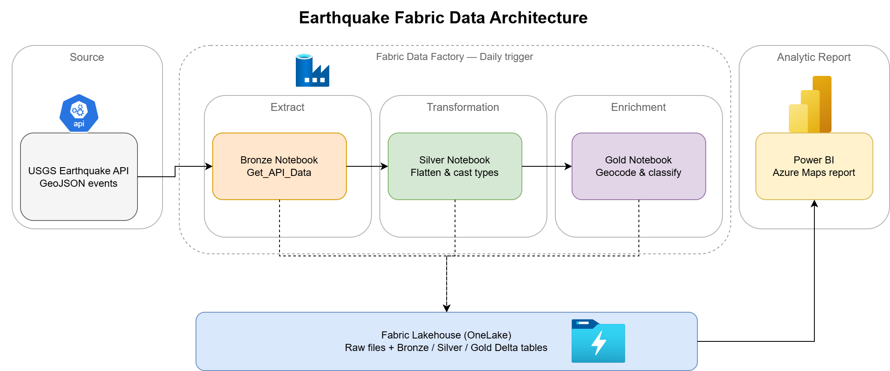
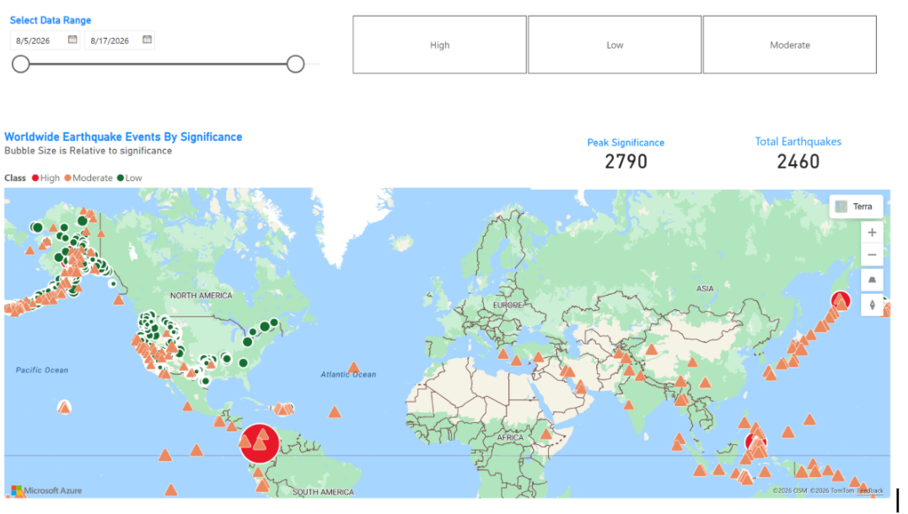

# Earthquake-ETL

## Purpose
This data pipeline collects, processes, and analyses global earthquake data from the USGS Earthquake API using Microsoft Fabric. The workflow extracts raw GeoJSON event data into a Fabric Lakehouse, refines it through a medallion (Bronze → Silver → Gold) architecture using PySpark notebooks, enriches each event with reverse-geocoded country codes and a significance classification, and orchestrates the whole process on a daily schedule with Fabric Data Factory. The end goal is a curated Delta table that feeds Power BI for interactive geospatial reporting.

## Architecture


## Data Flow
1. **Data Extraction:** A Fabric notebook calls the USGS FDSN Event API for a parameterised date range and lands the raw event features as JSON in the Lakehouse `Files` section.
2. **Data Transformation:** A PySpark notebook flattens the nested GeoJSON, renames and casts key attributes, and converts epoch milliseconds into timestamps.
3. **Data Enrichment:** A reverse geocoding UDF resolves each event's coordinates into a country code, and events are bucketed into significance classes.
4. **Data Orchestration:** Fabric Data Factory chains the three notebooks, passing `start_date` and `end_date` as parameters on a daily trigger.
5. **Data Storage:** Each layer is persisted as a managed Delta table in the Fabric Lakehouse.
6. **Data Visualization:** Power BI connects to the Gold table through the Lakehouse SQL analytics endpoint and renders events on an Azure Maps visual.

## Technologies Used
- **Microsoft Fabric:** Unified analytics platform hosting the entire solution.
- **Fabric Data Factory:** Orchestrates the notebooks and manages scheduling and parameters.
- **Fabric Notebooks (PySpark):** Execute the ingestion, transformation, and enrichment logic.
- **Fabric Lakehouse (Delta Lake):** Stores raw files and curated Delta tables across the medallion layers.
- **USGS Earthquake API:** Public source of real-time global seismic event data.
- **reverse_geocoder:** Offline Python library mapping coordinates to country codes.
- **Power BI (Azure Maps):** Connects to the Gold layer for geospatial reporting.

## Data Model
The Gold table is a single wide fact table at earthquake-event grain, ready for direct consumption in Power BI.

| Column | Type | Description |
| --- | --- | --- |
| `id` | string | Unique USGS event identifier (merge key) |
| `longitude` | double | Event longitude |
| `latitude` | double | Event latitude |
| `elevation` | double | Depth in km |
| `title` | string | Human-readable event title |
| `place_description` | string | Descriptive location text |
| `significance` | bigint | USGS significance score |
| `magnitude` | double | Event magnitude |
| `magType` | string | Magnitude measurement scale |
| `time` | timestamp | Event occurrence time |
| `updated` | timestamp | Last revision time from USGS |
| `country_code` | string | ISO country code from reverse geocoding |
| `sig_class` | string | `Low` / `Moderate` / `High` significance band |

## ETL Pipeline
The ETL pipeline consists of the following key tasks:

1. **Data Extraction:**
   - Call the USGS GeoJSON endpoint for the supplied date window and land the raw features in the Lakehouse.
2. **Data Transformation:**
   - Flatten the nested GeoJSON structs and cast epoch milliseconds to timestamps.
3. **Data Enrichment:**
   - Reverse geocode coordinates to country codes and classify significance.
4. **Data Loading:**
   - Merge each layer into its Delta table on `id` for idempotent, re-runnable loads.
5. **Data Visualization:**
   - Connect Power BI to the Lakehouse SQL analytics endpoint for interactive reporting.

### Bronze Layer — `Get_API_Data.ipynb`

```python
import requests
import json

# Construct the API URL with start and end dates provided by Data Factory
url = f"https://earthquake.usgs.gov/fdsnws/event/1/query?format=geojson&starttime={start_date}&endtime={end_date}"

response = requests.get(url)

if response.status_code == 200:
    data = response.json()['features']

    file_path = f'/lakehouse/default/Files/{start_date}_earthquake_data.json'

    with open(file_path, 'w') as file:
        json.dump(data, file, indent=4)

    print(f"Data successfully saved to {file_path}")
else:
    print("Failed to fetch data. Status code:", response.status_code)
```

### Silver Layer — `Silver_Layer.ipynb`

```python
from pyspark.sql.functions import col
from pyspark.sql.types import TimestampType

# Read the raw GeoJSON landed by the Bronze layer
df = spark.read.option("multiline", "true").json(f"Files/{start_date}_earthquake_data.json")

# Flatten the nested geometry and properties structs
df = df.select(
    'id',
    col('geometry.coordinates').getItem(0).alias('longitude'),
    col('geometry.coordinates').getItem(1).alias('latitude'),
    col('geometry.coordinates').getItem(2).alias('elevation'),
    col('properties.title').alias('title'),
    col('properties.place').alias('place_description'),
    col('properties.sig').alias('significance'),
    col('properties.mag').alias('magnitude'),
    col('properties.magType').alias('magType'),
    col('properties.time').alias('time'),
    col('properties.updated').alias('updated')
)

# Convert epoch milliseconds to timestamps
df = df \
    .withColumn('time', (col('time') / 1000).cast(TimestampType())) \
    .withColumn('updated', (col('updated') / 1000).cast(TimestampType()))
```

```python
from delta.tables import DeltaTable
from pyspark.sql.window import Window
from pyspark.sql.functions import row_number, col, desc

table_name = "earthquake_events_silver"

# USGS can return the same id twice in a window — keep the latest revision
w = Window.partitionBy("id").orderBy(desc("updated"))
df_dedup = df.withColumn("rn", row_number().over(w)).filter(col("rn") == 1).drop("rn")

if spark.catalog.tableExists(table_name):
    (DeltaTable.forName(spark, table_name).alias("t")
        .merge(df_dedup.alias("s"), "t.id = s.id")
        .whenMatchedUpdateAll(condition="s.updated > t.updated")
        .whenNotMatchedInsertAll()
        .execute())
else:
    df_dedup.write.saveAsTable(table_name)
```

### Gold Layer — `Gold_Layer.ipynb`

```python
from pyspark.sql.functions import when, col, udf
from pyspark.sql.types import StringType
# ensure the below library is installed on your fabric environment
import reverse_geocoder as rg

df = spark.read.table("earthquake_events_silver").filter(col('time') > start_date)


def get_country_details(lat, lon):
    """
    Retrieve the country code for a given latitude and longitude.

    >>> get_country_details(48.8588443, 2.2943506)
    'FR'
    """
    coordinates = (float(lat), float(lon))
    return rg.search(coordinates)[0].get('cc')


# Register the UDF so it can be used on Spark DataFrames
get_country_details_udf = udf(get_country_details, StringType())

df_with_country = df.withColumn(
    "country_code", get_country_details_udf(col("latitude"), col("longitude"))
)

# Adding significance classification
df_with_location_sig_class = df_with_country.withColumn(
    'sig_class',
    when(col("significance") < 100, "Low")
    .when((col("significance") >= 100) & (col("significance") < 500), "Moderate")
    .otherwise("High")
)
```

```python
from delta.tables import DeltaTable

table_name = "earthquake_events_gold"

# Materialise first so the reverse-geocoding UDF runs exactly once
df_gold = df_with_location_sig_class.cache()
print(df_gold.count())

if spark.catalog.tableExists(table_name):
    (DeltaTable.forName(spark, table_name).alias("t")
        .merge(df_gold.alias("s"), "t.id = s.id")
        .whenMatchedUpdateAll(condition="s.updated > t.updated")
        .whenNotMatchedInsertAll()
        .execute())
else:
    df_gold.write.saveAsTable(table_name)

df_gold.unpersist()
```

## Orchestration
The Data Factory pipeline chains three notebook activities in sequence, each receiving the same date window via base parameters:

```
start_date: @formatDateTime(addDays(utcNow(), -7), 'yyyy-MM-dd')
end_date:   @formatDateTime(utcNow(), 'yyyy-MM-dd')
```


Two configuration details matter on a small capacity:

- **Session tag.** Each notebook activity is given the same session tag under Advanced settings, so all three reuse a single Spark session rather than requesting one each. This requires **High concurrency for pipelines** to be enabled in Workspace settings → Spark settings.
- **Matching environments.** Session sharing only applies when the notebooks have identical session configuration, so all three are attached to the same custom environment (`earthquake_env`) that supplies `reverse_geocoder`.

Without these, the pipeline fails with `TooManyRequestsForCapacity` (HTTP 430) as each notebook competes for compute.

## Power BI Report
The report connects to `earthquake_events_gold` through the Lakehouse SQL analytics endpoint and plots epicentres on an Azure Maps visual.

Field setup:
- `latitude` → Latitude, `longitude` → Longitude, both with **Summarization: Don't summarize**
- `sig_class` → Legend, coloured red / amber / grey by severity
- `country_code`, `title`, `magnitude`, `time` → Tooltips

Because significance is long-tailed (1 to ~2,790), raw values make almost every bubble hit the maximum size. A scaling measure compresses the range so smaller events remain distinguishable:

```dax
Sqrt Significance = SQRT(MAX('earthquake_events_gold'[significance]))
```



## Repository Structure
```
Earthquake-ETL/
├── notebooks/
│   ├── Get_API_Data.ipynb      # Bronze — API ingestion
│   ├── Silver_Layer.ipynb      # Silver — cleaning and typing
│   └── Gold_Layer.ipynb        # Gold — enrichment and classification
├── pipeline/
│   └── earthquake_pipeline.json
├── docs/
│   └── images/
└── README.md
```

## Development Setup
To set up and run the pipeline in your own environment:

- Create a Fabric workspace with a Lakehouse named `earthquake_process`.
- Create a Fabric Environment with `reverse_geocoder` added as a public library, and attach it to all three notebooks.
- Import the notebooks and set the Lakehouse as the default lakehouse for each.
- Tag the first cell of each notebook as a **parameter cell** so Data Factory can inject `start_date` and `end_date`.
- Build the pipeline with three chained notebook activities, matching session tags, and a daily schedule.
- Enable **High concurrency for pipelines** in Workspace settings → Spark settings.
- Connect Power BI to the SQL analytics endpoint and build against `earthquake_events_gold`.

## Design Notes
- **Idempotent loads.** Silver and Gold write via Delta `MERGE` on `id` rather than appends, so re-runs and backfills update in place instead of duplicating events. The `s.updated > t.updated` condition also captures USGS revisions, which are common — events are frequently republished with corrected magnitudes.
- **UDF performance.** `reverse_geocoder` builds a k-d tree per executor, making the geocoding UDF the slowest step. Caching before the merge forces it to evaluate once rather than on every scan of the source DataFrame.
- **Filter column.** The Gold layer filters Silver on `time` (event time). Filtering on `updated` instead would also pull in revisions to older events, at the cost of a larger batch.
